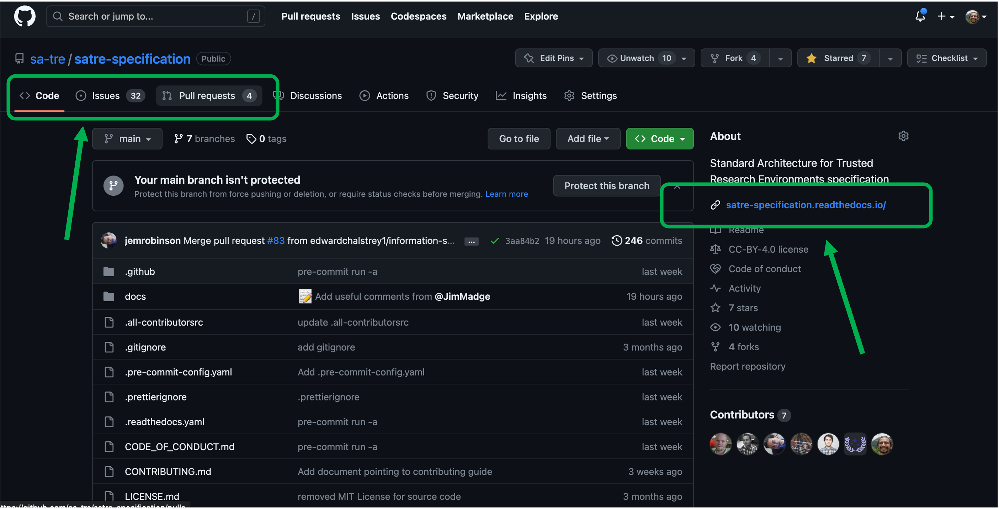
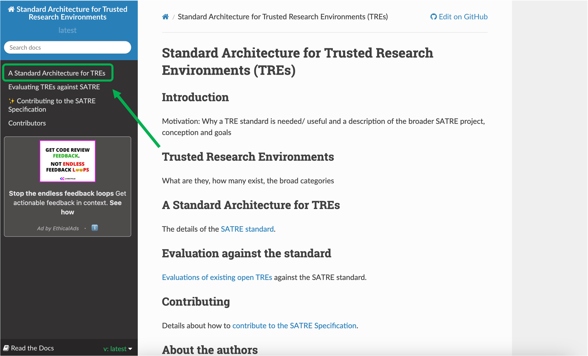
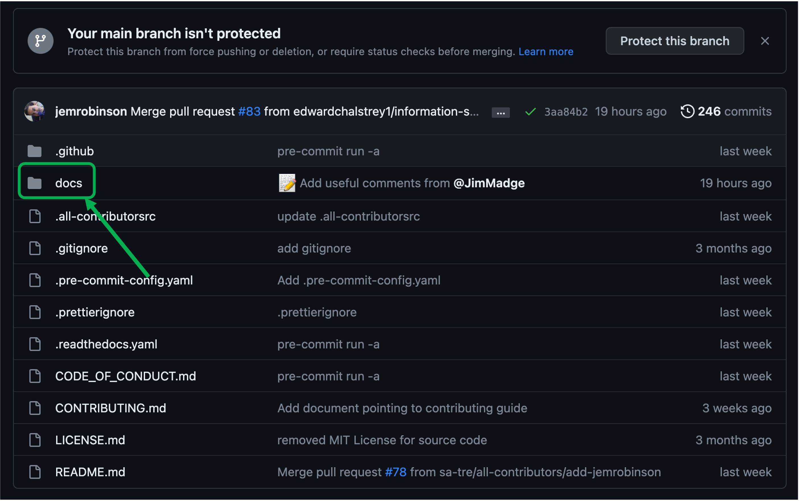
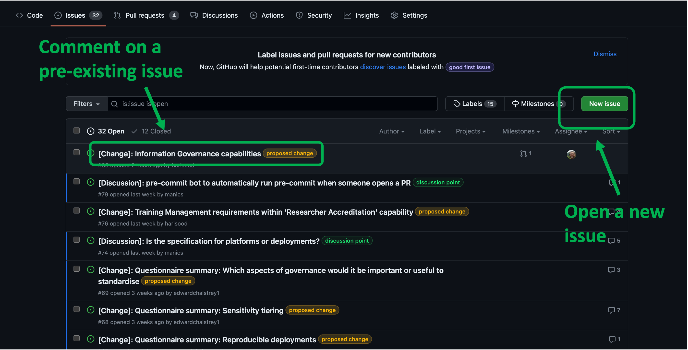
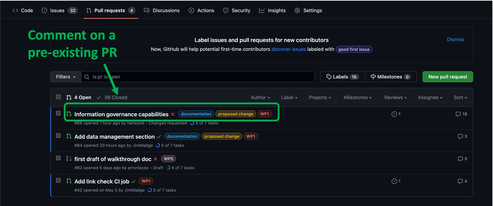
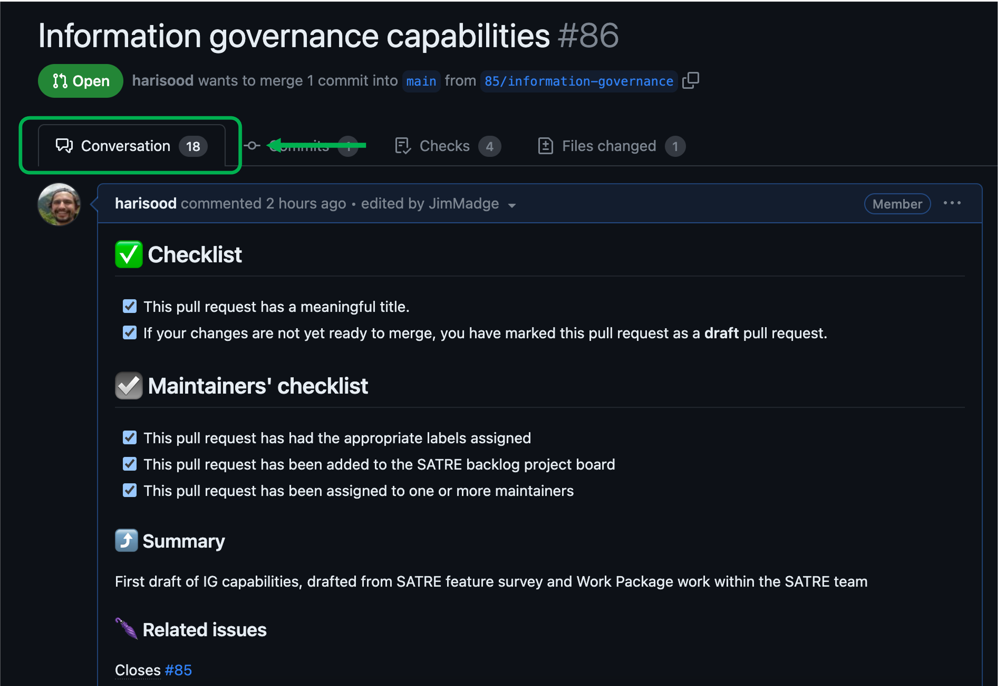
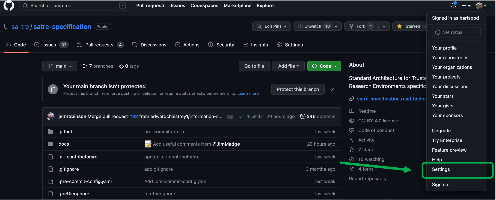
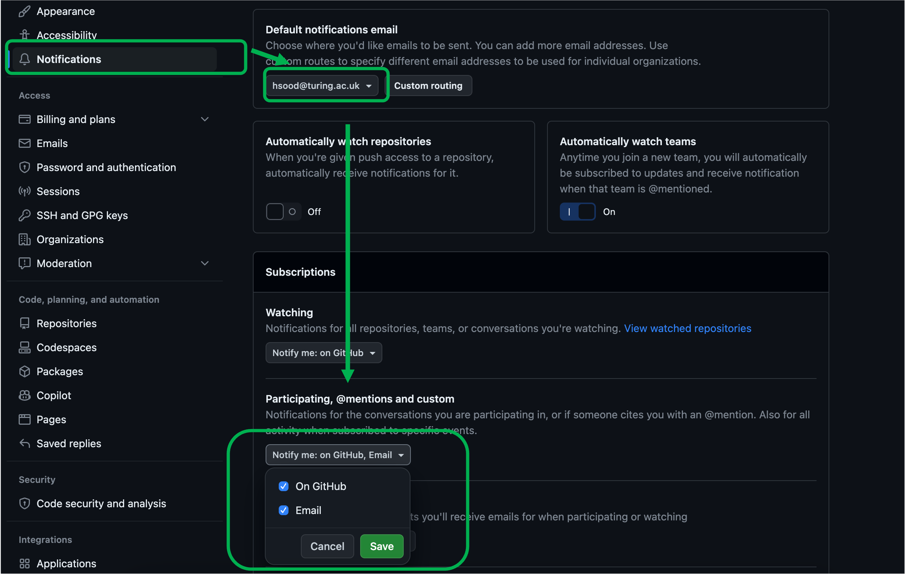

# SATRE Contribution Guide

## Overview

This guide aims to help new contributors get involved with the SATRE (Standard Architecture for Trusted Research Environments) project. SATRE is a collaborative effort between various universities and research institutions to develop a reference architecture for Trusted Research Environments in the UK. Your contributions, regardless of your experience level, are highly welcomed and appreciated.

## 1. Understanding the SATRE Project

Before getting involved, please read [SATRE's Kick Off Blog Post](https://medium.com/satre/satre-kick-off-sessions-87d3237107aa) (a 6 minute read) to understand the motivations of the project.

## 2. Join the Community

### 2.1 Join the Mailing List

To get the latest SATRE Newsletter and communications, please sign up to our [Mailing List](https://forms.office.com/e/FuFyNGx3hw)

### 2.2 Sign up to our Collaboration Cafes

We hold 1 hour online Zoom Collaboration Cafes to facilitate sharing ideas for what should be in the SATRE Specification.
Collaboration Cafe's happen at 3pm on the 1st Tuesday and 3rd Thursday of the month.
Please fill in [this form](https://forms.office.com/e/HdaVSj2V0c) to register your attendance in advance.

Collaboration Cafes are run using HackMD documents that will contain the meeting agenda and a place share notes.
If you are unfamiliar with HackMD, please see [this guide](https://hackmd.io/@turingway/hackmd-guide) on how to use it.
Please also see an [example HackMD](https://hackmd.io/N7EBtM6iS2OQsWCPWC-ojg) from our Collaboration Cafe on the 18th May 2023.
Each Collaboration Cafe uses Breakout Rooms where participants will work on themes e.g. Risk Management or Training Requirements.
Typically each Breakout Room is linked to an Issue on the [SATRE GitHub Issues Board](https://github.com/sa-tre/satre-specification/issues).



**Note:**
The HackMD for each Collaboration Cafe is made available in your calendar invites. We encourage you to propose a Breakout Room in advanced of the Collaboration Cafe, linking to a [SATRE GitHub Issue](https://github.com/sa-tre/satre-specification/issues) if possible. This will help participants come prepared to talk about certain topics. We also welcome Breakout Room proposals on the day though!



## 3. Review the SATRE Specification Document

The latest version of the SATRE Specification Document can be found [here](https://satre-specification.readthedocs.io/en/latest/). It is a living document in which the aim is to have a completed draft by October 2023.

## 4. Contribute to the SATRE Specification Document

As a collaborative project driven by community needs, we'd love for you to contribute directly to the specification.

There are two ways to do this:

1. Directly to the specification on GitHub (recommended, but more difficult)
2. To a non-GitHub version for the specification (less recommended, but easier)

Why the difference? GitHub is the live version of the specification, and is great for things like community discussions, version control, editing changes and more.
This is why we recommend contributing GitHub - it is the most direct way to work with the SATRE team on the specification.

However, we realise this may be difficult if you aren't already familiar with GitHub's ways of working.
Therefore we also have a non-GitHub version of the specification you can comment on.
Once a week, we will translate comments from this version to the GitHub repository for direct amendments.
So you are still able to contribute via this method, though all direct changes will still be taking place on GitHub.

### Contribute directly through GitHub

Below is a walkthrough of all the steps required to contribute via GitHub, from the very beginning.

This walkthrough is designed to give you the critical path steps to contributing directly to the Specification repo.
For a more broad, deeper introduction to GitHub, check out the Turing Way's [Introduction to GitHub Workshop](https://www.youtube.com/watch?v=Vcckl-2dASM), run at CarpentryCon22.

1. Go to the [GitHub homepage](https://github.com/)

2. In the top right corner, click either 'Sign In' (if you have an account already) or 'Sign Up'. You will need an email, password, username and one or two other things.

3. Once you are logged in, navigate to the [SATRE Specification page](https://github.com/sa-tre/satre-specification)

4. This is the SATRE specification **repository**. You can think of this like a directory containing all files to do with the SATRE specification. The main things to know about are the link in the `About` Section, and the `Code`, `Issues` and `Pull requests` tabs. Let's look at these in turn.

#### About link

This link will take you a readable version of the specification.
You can access the current live version of the specification by clicking on `A Standard Architecture for TREs` from the left hand navigation bar.
You can navigate directly to it [here](https://satre-specification.readthedocs.io/en/latest/standard.html)

#### Code

This is the default landing page of the repo, and contains all the code associated with the specification.
The most important one for you to know about is where the actual specification is being written.

You can find this by navigating to `docs` -> `source` -> `standard.md`.
This is the specification written in [Markdown](https://hackmd.io/@turingway/hackmd-guide), that renders into a website (which you can access from the `About` section).

Most `Issues` and `Pull requests` will be related to this file specifically - and this file is the official specification.
You can read more about `Issues` and `Pull requests` below.

#### Issues

Navigate to the the `Issues` tab.

This is where the community is having discussions about ideas for the specification.
You can think of it like an online forum where you start discussions and comment on pre-existing discussions.

There are two main things you can do:

- Comment on a pre-existing issue
- Open a new issue

##### Commenting on a pre-existing issue

1. Click on the title of the Issue - in the screenshot above, you can click on `[Change]: Information Governance capabilities`.

2. This should load the issue. You should be able to see the title of the issue, the summary of it (provided by the person who created the issue), and a place you can add comments at the bottom.

3. Commenting on an issue is really easy! Just write your comment in the space provided, and click `Comment`. Anyone following the issue will get notified that you've commented.

##### Creating a new issue

1. From the `Issues` page, click the green button `New issue`

2. You should be able to select a template for the issue you want to create - you can choose from the available options, or `Open a blank issue` of no template is right.

3. Fill in the template and select `Submit new issue`.

For more information on how Issues are being governed, see our [Contributing process](https://satre-specification.readthedocs.io/en/latest/contributing.html#contributing-contribution-process)

#### Pull requests

Navigate to the `Pull requests` tab.

Pull Requests (PRs) are where the community is making specific change proposals to the wording of the specification.
You can think of it like making suggested/track changes to a Google Doc or Word document.
These need to be reviewed by the SATRE team before they are accepted.

PRs are a little more difficult to wrap your head around!
This guide will show you how to comment on open PR.
For a deeper dive, including how to create a PR, make changes and more, we recommend the Turing Way's [Introduction to GitHub Workshop](https://www.youtube.com/watch?v=Vcckl-2dASM), run at CarpentryCon22

##### Comment on open Pull requests

This process will be similar to the one for Issues above

1. Click on the Title of a PR - in the screenshot above, you could click on `Information Governance capabilities`.

2. There are many things you can do on a PR - make changes to a file, comment on proposed changes, and more! For the purposes of this guide, we will just focus on comments. Make sure you are on the `Conversation` tab.

3. From here, you can comment in the same way as you did with Issues (add your comment at the bottom, and click `Comment`).

### Additional considerations for GitHub

#### Notifications

In order to make sure you stay informed of conversations you have joined, you need to make sure your notification settings are switched on

##### Notifications from the repository

From the `Code` tab, click `Watch` -> `Participating and @mentions`.
This will ensure you get notified to any conversations where you are already taking part, or are mentioned by someone else.
If you are really keen, you can turn on notifications for the whole repository, to be notified of any new issues or pull requests people open!

You will know you have the right setting when a tick appears next to your chosen notification level.

##### Notification streams

You can also decide how you receive notifications - whether just on GitHub, or also via email.
We recommend receiving `Participating and @mentions` notifications by email too, to ensure you don't miss any conversation you're invovled in!

1. Click your profile in the top right corner of GitHub and select `Settings`.

2. On left hand navigation bar, click `Notifications`. Ensure your email is the right one, and then in `Participating and @mentions` check both `GitHub` and `Email`, and click save.

You are done! You should now get emails for issues/PRs you are directly involved in across GitHub :rocket:
If this becomes annoying, you can always come back to this page to turn them off.

##### Helpful Markdown/GitHub tools

When you are commenting on Issues/PRs, there are a couple of handy things to know:

- You can mention others by tagging them with `@` followed by their GitHub username. For instance, to tag and notify Hari (GitHub username `harisood`), you can write `@harisood`
- All Issues and PR have a number associated with them. For instance, the number associated with the below issue is `85`. In any of your comments, you can reference an issue or PR by typing `#` followed by the number of the issue/PR you want to reference. For instance, to reference the below, you can type `#85`, and GitHub will magically create a link to it for you!

There will always be a dedicated Breakout Room in the Collaboration Cafes where one of the SATRE Team will be on hand to answer any questions and guide you through the GitHub Repository and help you get set up.

### Contribute via alternate streams

[**TO BE COMPLETED**]

## 6. Building the Specification Document locally

Instructions for building the specification document locally can be found [here](https://github.com/sa-tre/satre-specification/blob/main/docs/README.md#building-the-specification-document).

## 7. Code of Conduct

The SATRE project is dedicated to providing an inclusive and respectful environment for all participants. Please review the project’s [Code of Conduct](https://github.com/sa-tre/satre-specification/blob/main/CODE_OF_CONDUCT.md) before starting your contribution.

## 8. Contact

If you have any questions or concerns, reach out to SATRE project team member Hari Sood (@harisood, hsood@turing.ac.uk) or Arron Lacey (@arronlacey, alacey@turing.ac.uk).
