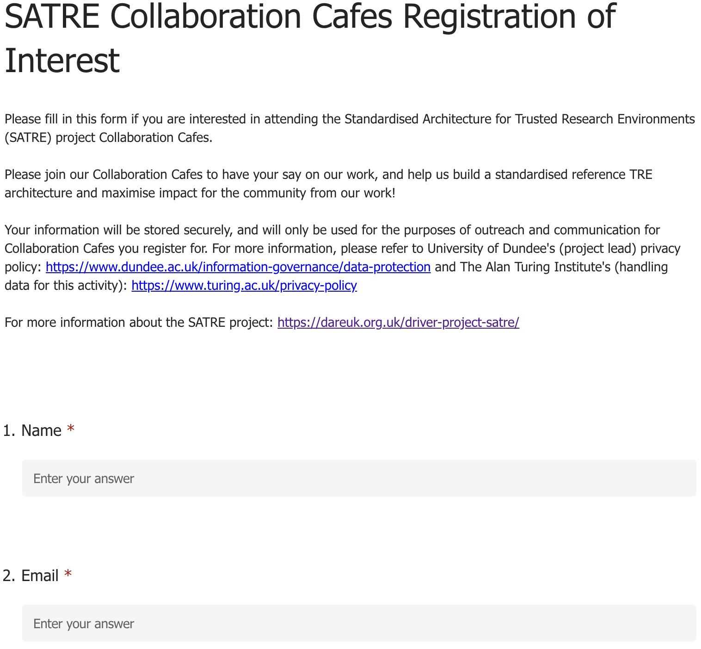
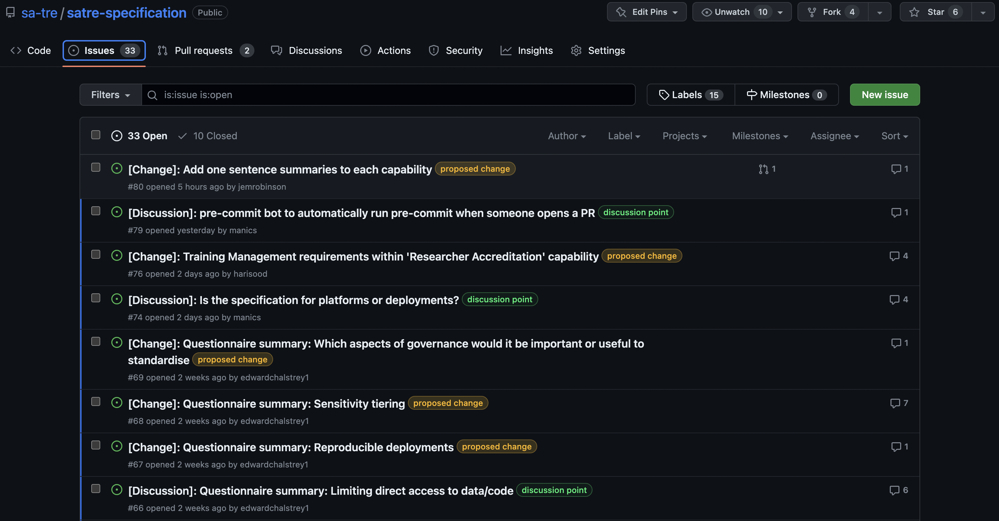

# SATRE Contribution Guide

## Overview

This guide aims to help new contributors get involved with the SATRE (Standard Architecture for Trusted Research Environments) project. SATRE is a collaborative effort between various universities and research institutions to develop a reference architecture for Trusted Research Environments in the UK. Your contributions, regardless of your experience level, are highly welcomed and appreciated.

## 1. Understanding the SATRE Project

Before getting involved, please read [SATRE's Kick Off Blog Post](https://medium.com/satre/satre-kick-off-sessions-87d3237107aa) (a 6 minute read) to understand the motivations of the project.

## 2. Join the Community

### 2.1 Join the Mailing List
To get the latest SATRE Newsletter and communications, please sign up to our [Mailing List](https://eur01.safelinks.protection.outlook.com/?url=https%3A%2F%2Fturing-uk.zoom.us%2Fj%2F99226214703%3Fpwd%3DVWRaWXhacitRS25KODRLOXN3bkI2UT09%26from%3Daddon&data=05%7C01%7Calacey%40turing.ac.uk%7C7d03b9be41e44153906908db5c74ac3a%7C4395f4a7e4554f958a9f1fbaef6384f9%7C0%7C0%7C638205428538085283%7CUnknown%7CTWFpbGZsb3d8eyJWIjoiMC4wLjAwMDAiLCJQIjoiV2luMzIiLCJBTiI6Ik1haWwiLCJXVCI6Mn0%3D%7C3000%7C%7C%7C&sdata=XMciV4J2%2BbqM08EvNXD%2FghIoihHB0hZgleS%2B4iAbXo8%3D&reserved=0)

### 2.2 Sign up to our Collaboration Cafes
We hold 1 hour online Zoom Collaboration Cafes to facilitate sharing ideas for what should be in the SATRE Specification. 
Collaboration Cafe's happen at 3pm on the 1st Tuesday and 3rd Thursday of the month. 
Please fill in [this form](https://forms.office.com/Pages/DesignPageV2.aspx?subpage=design&token=262b30c6133e4c6fba332734597ada39&id=p_SVQ1XklU-Knx-672OE-XMfskt9FY5HraQ6BiwaEGBUNUg1T05DNEJMNEtaN0JOOURKTDBFUENFQi4u) to register your attendance in advance. 

Collaboration Cafes are run using HackMD documents that will contain the meeting agenda and a place share notes. 
Please see an [example HackMD](https://hackmd.io/N7EBtM6iS2OQsWCPWC-ojg) from our Collaboration Cafe on the 18th May 2023. 
Each Collaboration Cafe uses Breakout Rooms where participants will work on themes e.g. Risk Management or Training Requirements. 
Typically each Breakout Room is linked to an Issue on the [SATRE GitHub Issues Board](https://github.com/sa-tre/satre-specification/issues). 



**Note:**
The HackMD for each Collaboration Cafe is made available in your calendar invites. We encourage you to propose a Breakout Room in advanced of the Collaboration Cafe, linking to a [SATRE GitHub Issue](https://github.com/sa-tre/satre-specification/issues) if possible. This will help participants come prepared to talk about certain topics. We also welcome Breakout Room proposals on the day though!



## 3. Review the SATRE Specification Document
The latest version of the SATRE Specification Document can be found [here](https://satre-specification.readthedocs.io/en/latest/). It is a living document in which the aim is to have a completed draft by October 2023

## 4 Review the SATRE Specification GitHub Repository

Go to GitHub.com

If you have an account, Login, otherwise Sign up (you will need email password).
Once logged in, navigate to https://github.com/sa-tre/satre-specification. 
This will load the SATRe specification 'repository' or 'repo'. 
You can think of this like a directory containing all files to do with the SATRE specification.
You should see some tabs saying 'Code', 'Issues', 'Pull requests' etc. 

For this project, the main tabs to focus on are:
**Issues:** This is where the community is having discussions about ideas for the specification. You can think of it like a forum
**Pull Requests:** This is where the community is making specific change proposals to the wording of the specification. You can think of it like making suggested/track changes to a Google Doc or Word document. 
These need to be reviewed by the SATRE team before they are accepted.
All these conversations ultimately influence what the specification says. You can access the latest version of the specification here. You can also access this via the link in the 'About' section on the home page of the repo, and navigating through the website.

The SATRE Specification Document is built from `markdown` files authored on the [SATRE Specification GitHub Repository](https://github.com/sa-tre/satre-specification). 
Ideas for what should be in the Specification Document are ideated through Issues and usually discussed at Collaboration Cafes. 

Pull Requests are used to author a section into the Specification based on content from Issues. 
Currently we ask SATRE Community members to Fork the repository to make Pull Requests. 

There will always be a dedicated Breakout Room in the Collaboration Cafes where one of the SATRE Team will be on hand to answer any questions and guide you through the GitHub Repository and help you get set up.

## 5. Contributing to SATRE
There are various ways to contribute to SATRE.
A detailed guide can be found in our [Contributing Guide](https://satre-specification.readthedocs.io/en/latest/contributing.html). 
Here is a summary of how you can contribute:

- Create or comment on [Issues](https://github.com/sa-tre/satre-specification/issues). Issues may pertain to the Specification Document or anything else about the SATRE Project such as an idea for engaging better with the community or how we run our events.
- Write down ideas in the Collaboration Cafe HackMDs. A SATRE Team member will be available to help place any suggestions into Issues, but if you are able to do this yourself we encourage you to do so.
- Create, collaborate or comment on Pull Requests. Pull Requests create or edit the markdown files needed to build the SATRE Specification.
- Comment on a [Google Doc Version](https://populatatethislink.com) of the Specification Document if you aren't comfortable using GitHub. Please put your name by each comment so that we can attribute your contribution on the appropriate Issue or Pull Request. 

## 6. Building the Specification Document locally

Instructions for building the specification document locally can be found [here](https://github.com/sa-tre/satre-specification/blob/main/docs/README.md#building-the-specification-document).

## 7. Code of Conduct

The SATRE project is dedicated to providing an inclusive and respectful environment for all participants. Please review the project’s [Code of Conduct](https://github.com/sa-tre/satre-specification/blob/main/CODE_OF_CONDUCT.md) before starting your contribution.

## 8. Contact
If you have any questions or concerns, reach out to SATRE project team member Hari Sood (@harisood, hsood@turing.ac.uk) or Arron Lacey (@arronlacey, alacey@turing.ac.uk).